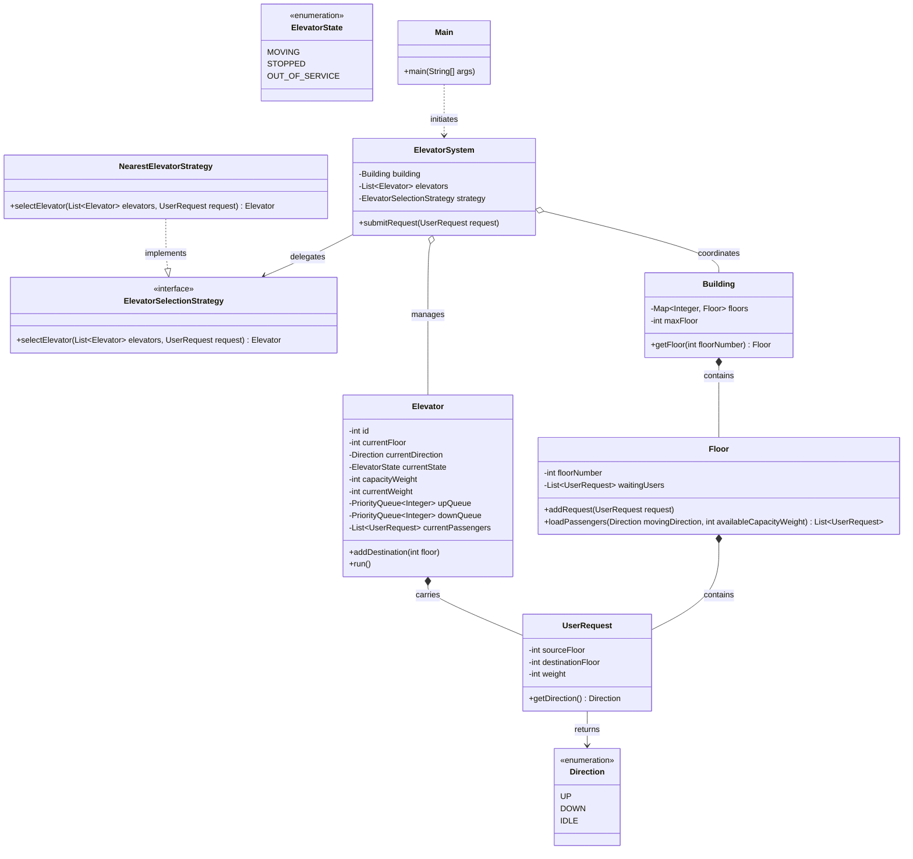

# Elevator System Simulation (Low-Level Design)

## Problem Explanation
The objective of this project is to model a multi-elevator system for a building. The system must support concurrent real-world interactions such as users requesting elevators from disparate floors, elevators managing load constraints (capacity by weight), and intelligent scheduling. 

Key challenges addressed in this design:
- **Object-Oriented Integrity:** Creating clear boundaries between the system (mediator), the elevators (actors), the floors (state holders), and the user requests.
- **Concurrency Handling:** Each elevator operates independently while sharing requests via thread-safe constructs.
- **Scheduling Strategies:** We must decide dynamically which elevator best handles an incoming external request.
- **Load and Stop Management:** Elevators must sequence their stops using logic that minimizes traversal (e.g., stopping for all requests in the current path).

## Solution Approach
Our solution applies robust low-level design patterns to satisfy these requirements:

1. **Entities & Abstractions:**
   - `UserRequest`: Encapsulates source floor, destination floor, and passenger weight.
   - `Floor`: Holds synchronized queues of waiting passengers. It's responsible for managing and loading the passengers when an elevator arrives.
   - `Building`: A composite containing all the physical floors.

2. **Concurrency & Threading (`Elevator.java`):**
   - Each `Elevator` implements `Runnable` and is spawned in its own thread. 
   - Queues are maintained inside the `Elevator`: an **upQueue** (Min-Heap) and a **downQueue** (Max-Heap) to maintain positional progression instead of temporal progression.
   - Passenger loading and queue modification is strictly synchronized to prevent race conditions when the `ElevatorSystem` injects external requests while the elevator processes internal events.

3. **Strategy Pattern (`ElevatorSelectionStrategy`):**
   - The system utilizes a pluggable strategy interface to determine the best elevator for a request.
   - The default `NearestElevatorStrategy` calculates absolute distances but gives significant precedence to elevators already moving toward the requested direction.

4. **Mediator (`ElevatorSystem`):**
   - The `ElevatorSystem` delegates passenger requests to a specific `Elevator` based on the strategy and adds the passenger to the correct `Floor`'s boarding list.

## Testing the Code
To run the fully functional multi-threaded simulation, compile the `.java` files and execute the `Main` class.

```bash
cd src/main/java
javac com/elevator/main/Main.java com/elevator/models/*.java com/elevator/strategy/*.java com/elevator/system/*.java
java com.elevator.main.Main
```
**Note:** The system will output the real-time movement and passenger load/unload events. To terminate the infinite elevator listener loop, press `Ctrl+C`.

## Class Level Implementation (UML Diagram)


